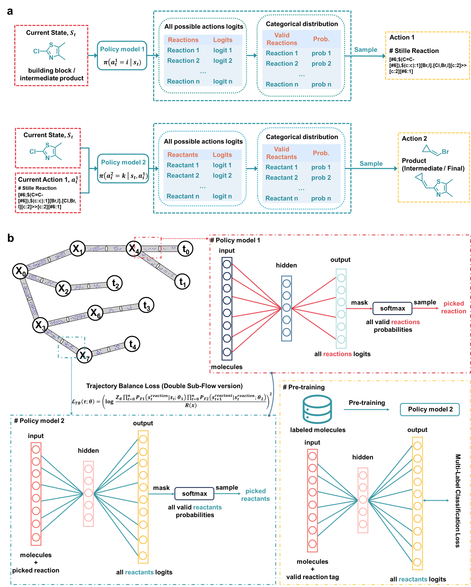

# SynGFN

This repository contains the implementation code for our research paper, "[SynGFN: Expanding the Frontier of Synthesis-Constrained Chemical Space with Generative Flow-based Molecular Discovery]" 


## Introduction
SynGFN features two key ingredients: (1) a hierarchically pre-trained policy network that significantly acceler-ates learning across diverse distributions of desirable molecules in chemical spaces, and (2) a multi-fidelity active learning framework to alleviate the cost of  reward evaluations.



## Dependencies

- Python 3.9.18
- PyTorch 2.1.0

For the complete list of dependencies, please refer to the `requirements.txt` file.


## Usage

To train a SynGFN model with the default configuration, simply run

```bash
python main.py user.logdir.root=<path/to/log/files/>
```

Alternatively, you can create a user configuration file in `config/user/<username>.yaml` specifying a `logdir.root` and run

```bash
python main.py user=<username>
```

For the configuration and data processing, please refer to each folder's `README.md` file.


## Citation
If you find the models useful in your research, please cite our paper.
We have developed our codes based on the [gflownet](https://github.com/alexhernandezgarcia/gflownet) and [mf-al-gfn](https://github.com/nikita-0209/mf-al-gfn). We really appreciate these excellent works!


## Contact
If you have any question, please feel free to email us (yuchenzhu@zju.edu.cn).