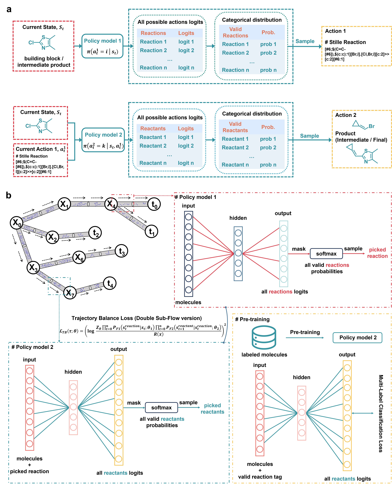

# SynGFN

This repository contains the implementation code for our research paper, [SynGFN: Expanding the Frontier of Synthesis-Constrained Chemical Space with Generative Flow-based Molecular Discovery]() 

## Introduction

SynGFN features two key ingredients: (1) a hierarchically pre-trained policy network that significantly accelerates learning across diverse distributions of desirable molecules in chemical spaces, and (2) a multi-fidelity active learning framework to alleviate the cost of reward evaluations.



## Installation

Follow these steps to set up the environment and install all dependencies for this project.

```bash
conda create --name syngfn python==3.9.18
conda activate syngfn
bash install_dependencies.sh
```

## Data

SynGFN requires the reaction template set and the building block library.

The reaction template set we selected mainly come from 58 robust reactions published by [Hartenfeller et al](https://pubs.acs.org/doi/10.1021/ci200379p) and the virtual reaction database published by [Button et al](https://www.nature.com/articles/s42256-019-0067-7), which includes 64 reactions. Solvents, catalysts, and constant reagents are omitted from the Reaction SMARTS. None of the reactions have defined the stereochemistry of the products. The template set is available under [data/template.py](data/template.py).

The Enamine building block library is available upon request at [https://enamine.net/building-blocks/building-blocks-catalog](https://enamine.net/building-blocks/building-blocks-catalog). We used the "Global Stock" released at 2023.07.17. In our work, we further divided the building block library into four different scales, denoted as S (Small), M (Me-dium), L (Large), and XL (Extreme Large). The specific data processing and construction process is available in [dataprocess/README.md](dataprocess/README.md).

## Main Components

The SynGFN framework consists of four core components: Environment, Proxy, Policy Models, and the GFlowNet Agent.
1.[Environment](gflownet/envs)
The environment defines the state space and the hierarchical action space. In SynGFN, we treat the selection of reactions and reactants as two separate actions: Action 1 and Action 2.
2.[Proxy](gflownet/proxy)
The proxy refers to the model that provides rewards for the states of the environment. In this work, we use QSAR model as the scoring function (proxy) for generated molecules.
3.[Policy Models](gflownet/policy)
The policy models define neural networks that model state transitions. For the current task, simple multi-layer perceptrons (MLPs) with a few layers are sufficient to meet the requirements.
4.[GFlowNet Agent](gflownet/gflownet.py)
The GFlowNet agent is responsible for orchestrating the interactions between the environment, proxy, and policy models. In this implementation, we adopt the [trajectory balance loss](https://arxiv.org/abs/2201.13259) as the training objective.

## Usage

To train a SynGFN model with the default configuration, simply run

```bash
python main.py user.logdir.root=<path/to/log/files/>
```

Alternatively, you can create a user configuration file in `config/user/<username>.yaml` specifying a `logdir.root` and run

```bash
python main.py user=<username>
```

For more detailed explanations, please refer to each folder's `README.md` file.

## Explanation of Results

To better illustrate the generation results of SynGFN, we have included an example case [logs/example](logs/example). This example provides detailed explanations of the three main output files generated by SynGFN.

## Citation
If you find the models useful in your research, please cite our paper.
We have developed our codes based on the [gflownet](https://github.com/alexhernandezgarcia/gflownet) and [mf-al-gfn](https://github.com/nikita-0209/mf-al-gfn). We really appreciate these excellent works!


## Contact
If you have any question, please feel free to email us (yuchenzhu@zju.edu.cn).